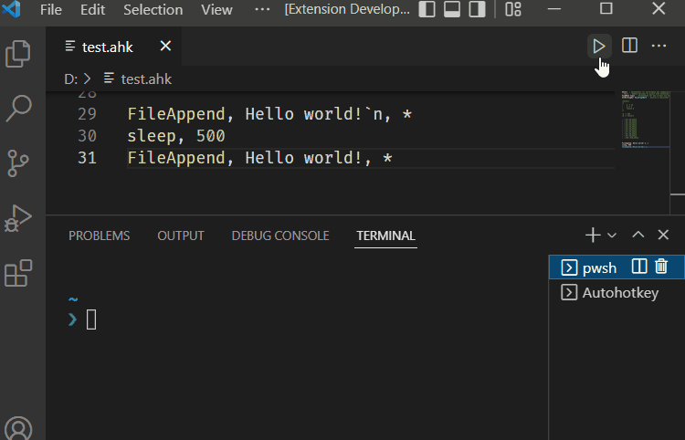

# Visual Studio Code Autohotkey Simple Support

<div align="center">

[](https://marketplace.visualstudio.com/items?itemName=helsmy.ahk-simple-ls)     

</div>

A personal edition modified from [vscode-autohotkey](https://github.com/vinnyjames/vscode-autohotkey)  
And Microsoft lsp-simple

AutoHotKey language support for VS Code

## What's New

1. Run button (run current file in terminal) and two command. For details, see changelog.
2. Build-in Variable and Function(partly) hint.
   - Need documentions which is easy to be parsed by js/ts. If you find any, help please([Example](others/Contribute.md)).

## Notice

* **Recursive descent parser** is under alpha stage, if you want to use old one, you can go to [here](https://github.com/helsmy/vscode-autohotkey/releases/tag/0.5.10) to download it
* Experimental hint for where symbol is included on completion. ONLY work on global symbol.
* Enumerate include
   * Documents must be explicitly included by `#include`
   * **Notice** `#include DirName` are not implemented now
* If you need a debugger, just install any debug extension in market. As recommended options, [AutoHotKey Debug](https://marketplace.visualstudio.com/items?itemName=helsmy.autohotkey-debug) by me or [vscode-autohotkey-debug](https://marketplace.visualstudio.com/items?itemName=zero-plusplus.vscode-autohotkey-debug) by zero-plusplus

## Run This in Vim

For vim user, how to use this extension in vim.
1. Install coc.nvim.
2. Go to [vscode markertplace](https://marketplace.visualstudio.com/items?itemName=helsmy.ahk-simple-ls) to download the vsix file of this extension.
3. Use 7-zip or other unzip software to unzip the vsix.
4. Open `coc-settings.json` by `:CocConfig`. Add this configuration to your coc configuration file:
```json
"languageserver": {
  "Autohotkey": {
    "module": "your-unzip-dir/extension/server/out/server.js",
    "args": ["--node-ipc"],
    "filetypes": ["autohotkey"],
    "trace.server": "off",
    "documentLanguage": "no"
  }
}
```
5. restart vim, and open an ahk file.
6. Besides, coc.nvim may need a little configuration. Those can be find in the homepage of coc.nvim.

## Feature

* A better tmlanguage based highlight
* Comment blocks
* Snippets
* Code Completion
* Document symbol(class, method, variable, label, hotkey) 
* Goto Definition(only works for "code", file name is not supported for now)
* Signature Helper (tooltip for method parameters)
* Enumerate include documents
  * The documents must be explicitly included by `#include`
* Folding region commnet
  * mark region start by `;[region]`
  * mark region end by   `;[endregion]`


## Settings

1. Autohotkey Language Server: Document Language  
   Language of documents of built-in variables and fucntions.  
   Only Chinese documents of built-in variables(Option: CN) available now
2. Autohotkey Language Server>Trace: Server  
   Traces the communication between VS Code and the language server.

## Preveiw

### Run File


### Code Completion


### Signature Help


### Format Document


### Folding Region


## Further Plan

* [x] Language server
* [ ] Build-in Function hint
  * [x] Build-in Variable hint(Need Docs)
  * [x] Function hint(Need Docs)
* [x] Better syntax tree
* [x] Code formation
  * [ ] improvement needed
* [x] Enumerate include
  * [ ] Document cache improvement needed 
* [ ] Function debounce 
* [ ] Syntax analyze based parser  
* [ ] Enable documentation markdown

## Thanks

1. vinnyjames
2. stef-levesque
3. denolfe
4. Microsoft lsp-simple
5. jonnyboyC el. (kos-langeuage-sever)
6. bitwiseman(js-beautify)
7. 天黑请闭眼(modify js-beautify for ahk)

